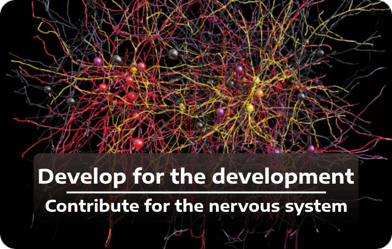

<small>Feel free to <a href="https://github.com/amirHossein-Ebrahimi/ComputationalNeuroScience/blob/master/CONTRIBUTING.md"><b>contribute</b></a> & <a href="https://github.com/amirHossein-Ebrahimi/ComputationalNeuroScience/issues/new"><b>open an issue</b></a> to help <code>the nervous system</code></small>

## Project charters and tutorial series

1. [**Neuron Models**](https://github.com/amirHossein-Ebrahimi/awesome-computational-neuro-science/blob/master/notebooks/Project%201/SNN%20Models.ipynb)
2. [**Neural Population**](https://github.com/amirHossein-Ebrahimi/awesome-computational-neuro-science/blob/master/notebooks/Project%202/Neuron%20Population.ipynb)
3. [**Unsupervised STDP Learning**](https://github.com/amirHossein-Ebrahimi/awesome-computational-neuro-science/blob/master/notebooks/Project%203/STDP.ipynb)
4. [**Reward Modulated STDP Learning**](https://github.com/amirHossein-Ebrahimi/awesome-computational-neuro-science/blob/master/notebooks/Project%204/reward%20modulated%20STDP.ipynb)
5. [**DoG & Gabor in Convolution**](https://github.com/amirHossein-Ebrahimi/awesome-computational-neuro-science/blob/master/notebooks/Project%205/convolution.ipynb)
6. [**Full object detection model based on spiking neural network**](https://github.com/amirHossein-Ebrahimi/awesome-computational-neuro-science/tree/master/notebooks/abstract%20Neural%20Models)

## DoG & Gabor in Convolution

- [x] [Gabor Filter](https://en.wikipedia.org/wiki/Gabor_filter)
- [x] [Difference of Gaussian](https://en.wikipedia.org/wiki/Difference_of_Gaussians)
- [x] Feature map
- [x] Detect dominant lines and features, and show improvement and precision through time

## Unsupervised STDP Learning

- [x] Implementation Unsupervised STDP Learning
- [x] Plot delta weights caused by STDP learning for two neuron with random excitation
- [x] Generate 10x2 Spiking Networks & learn Two 10th-tuple by each output neuron
- [x] Add an inhibitory neuron to upper network

## Full object detection model based on spiking neural network

Model trained and tested on [caltech101](https://www.tensorflow.org/datasets/catalog/caltech101) dataset

> Caltech-101 consists of pictures of objects belonging to 101 classes, plus one background clutter class. Each image is labelled with a single object. Each class contains roughly 40 to 800 images, totalling around 9k images. Images are of variable sizes, with typical edge lengths of 200-300 pixels.

We presents an deep spiking neural model which consist of 3 layer. for first two layer only STDP learning is used, and for last layer dopamine releases followed by STDP and anti-STDP.

**For more documentation see code, documentation will be updated**

---

> [class videos and Lecture Notes](https://t.me/CNRLab)
>
> Computational Neuroscience Research Lab. (Department of Computer Science, University of Tehran) For more info, please visit [cnrl.ut.ac.ir](https://cnrl.ut.ac.ir/)

